# ZJU-blockchain-course-2024

⬆ 可以️修改成你自己的项目名。

> 第二次作业要求（以下内容提交时可以删除）：
> 
> 去中心化房屋购买系统，参与方包括：房屋拥有者，有购买房屋需求的用户
>
> 建立一个简易的房屋出售系统，在网站中：
> - 创建一个（ERC721）合约，在合约中发行房屋集合，每个NFT代表一栋房屋。让部分用户免费领取部分房屋NFT，用于后面的测试。
> - 在网站中，用户可以出售，或者使用测试以太币购买房屋。每个用户可以： 
>  1. 用户查看自己拥有的房产列表。并可以挂单出售自己的房屋（挂单包含价格等信息）。
>  2. 用户查看所有出售中的房产，并查询一栋房产的主人，及各种挂单信息。
>  3. 用户选择支付房屋价格对应的测试以太币，购买某个其他用户出售的房产。购买后房产拥有权应当发生变化。
>  4. 平台收取手续费：在一个房产出售完成时，用户支付的部分测试以太币（=某栋房产在平台上的挂单时长（timestamp）* 固定比例 * 房产价格）应该被转入某个特定账户（如合约部署者）。
      。
> - （Bonus，如果想要完成Bonus，可以直接将功能整合进上述要求中）发行一个（ERC20）合约，允许用户将测试以太币兑换成ERC20积分，并使用ERC20积分完成购买房屋的流程。
> - 请大家专注于功能实现，网站UI美观程度不纳入评分标准，但要让用户能够舒适操作。简便起见，可以在网上找图片代表不同房产，不需要将图片上链。

**以下内容为作业仓库的README.md中需要描述的内容。请根据自己的需要进行修改并提交。**

作业提交方式为：**提交视频文件**和**仓库的链接**到指定邮箱。

## 如何运行


1. 在本地启动ganache应用。
    将端口改为8545，链id改为1337，同时metamask也要做对应的修改

2. 在 `./contracts` 中安装需要的依赖，运行如下的命令：
    ```bash
    npm install
    ```
3. 在 `./contracts` 中编译合约，运行如下的命令：
    ```bash
    npx hardhat compile
    npx hardhat run ./scripts/deploy.ts --network ganache  //在这一步之前需要把hardhat.config.ts里的私钥改为自己的
    ```
4. 随后将终端显示出的部署生成的两个合约地址复制到./frontend/src/utils/contract-addresses.json
5. 将./contracts/artifacts/contracts目录下的BuyMyRoom.json和MyERC20.json复制到./frontend/src/utils/abis目录下覆盖掉原有的.json文件，可能提示要还要下载web3等，根据报错提示即可正常进行；
6. 在 `./frontend` 中安装需要的依赖，运行如下的命令：
    ```bash
    npm install
    ```
7. 在 `./frontend` 中启动前端程序，运行如下的命令：
    ```bash
    npm run start
    ```

## 功能实现分析

项目实现了预期的所有功能：
1.首先是创建一个（ERC721）合约，即BuyMyRoom.sol，在合约中发行房屋集合，每个NFT代表一栋房屋。让部分用户免费领取部分房屋NFT，这里我在合约里设置的是所有用户目前都可以免费领取测试房屋NAT
2.用户查看自己拥有的房产列表。并可以挂单出售自己的房屋（挂单包含价格等信息）：用户在领取房屋后刷新页面，即可看到自己的房产列表，同时可对自己的房产进行挂单销售
3.用户选择支付房屋价格对应的测试以太币，购买某个其他用户出售的房产。购买后房产拥有权应当发生变化：其他用户挂单交易后，所有的用户都可以看到，同时用户只要余额充足，在支付后刷新页面，即可看到房产所有权的转化
4.平台收取手续费：在一个房产出售完成时，用户支付的部分测试以太币（=某栋房产在平台上的挂单时长（timestamp）* 固定比例 * 房产价格）应该被转入某个特定账户：在这里我设置的比例为5%，支付成功后，交易额的5%无论是ETH还是ERC20积分都将转5%到合约创建者的账户中
5.bonus:在BuyMyRoom中我创建了一个ERC20合约，在这个合约里用户可以免费领取1000ERC积分，ERC20积分与ETH的转化比例为10:1，同时支持ETH货币转为ERC20积分与ERC20积分购买房产
## 项目运行截图

首先在账号1上铸造房产：
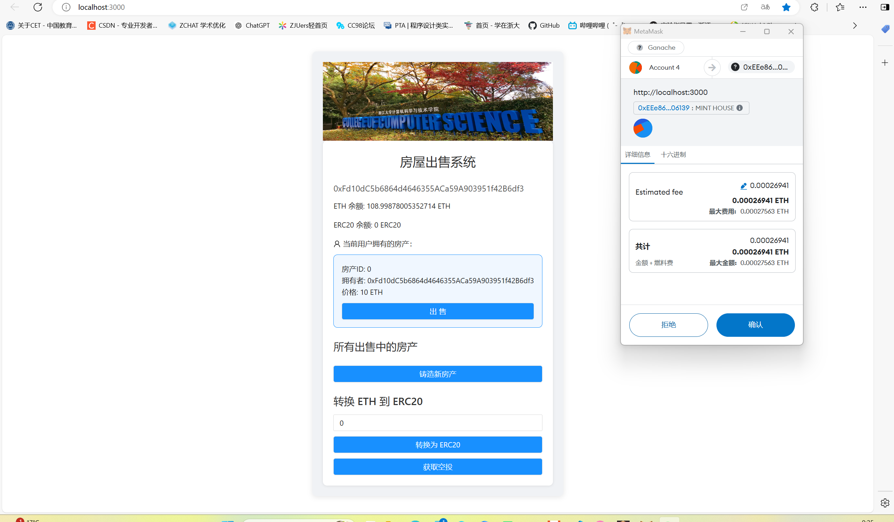
然后可以看到房产增加：

然后将拥有的房屋挂单交易，在设置价格点击确认支付后会有格式上的报错提醒，这只是格式上的问题，对功能没有影响：
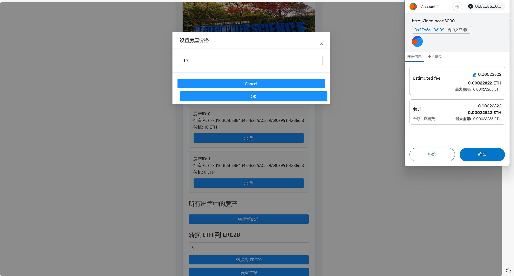
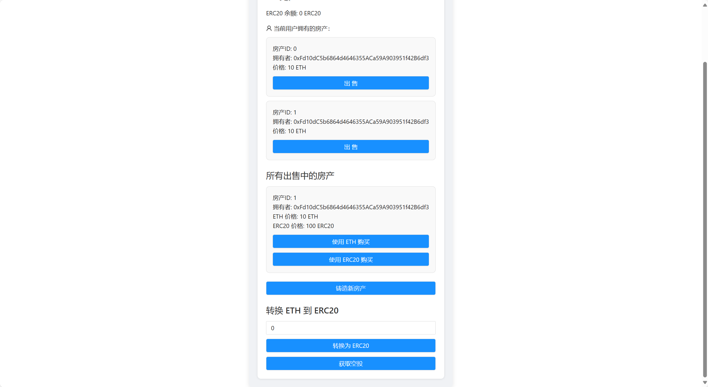
同理将第二个房屋也挂单交易：
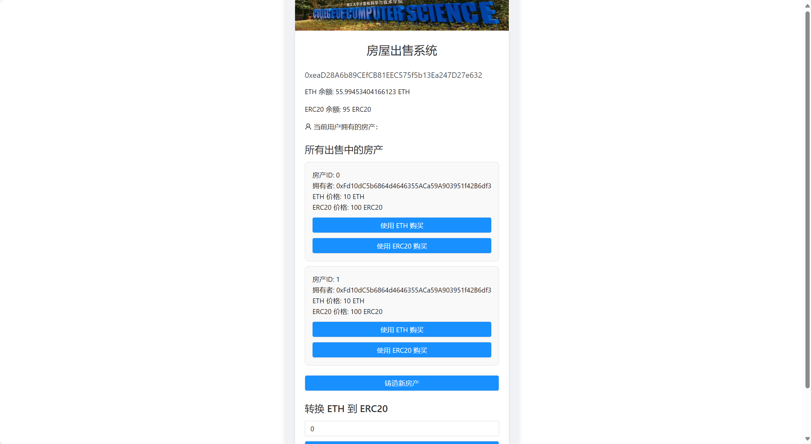
然后切换到其他账户，获取空投的1000ERC20积分：
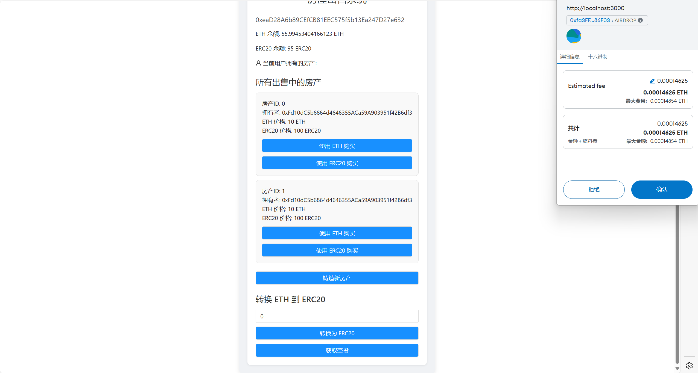
获取之后：
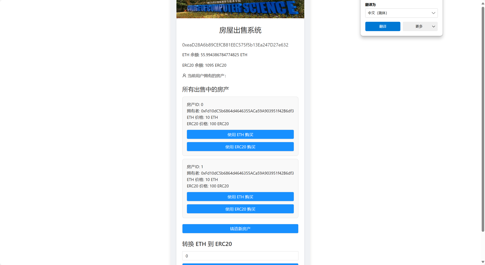
这时采用ETH购买第一个：

这是购买前第一个账户的余额：104.9ETH
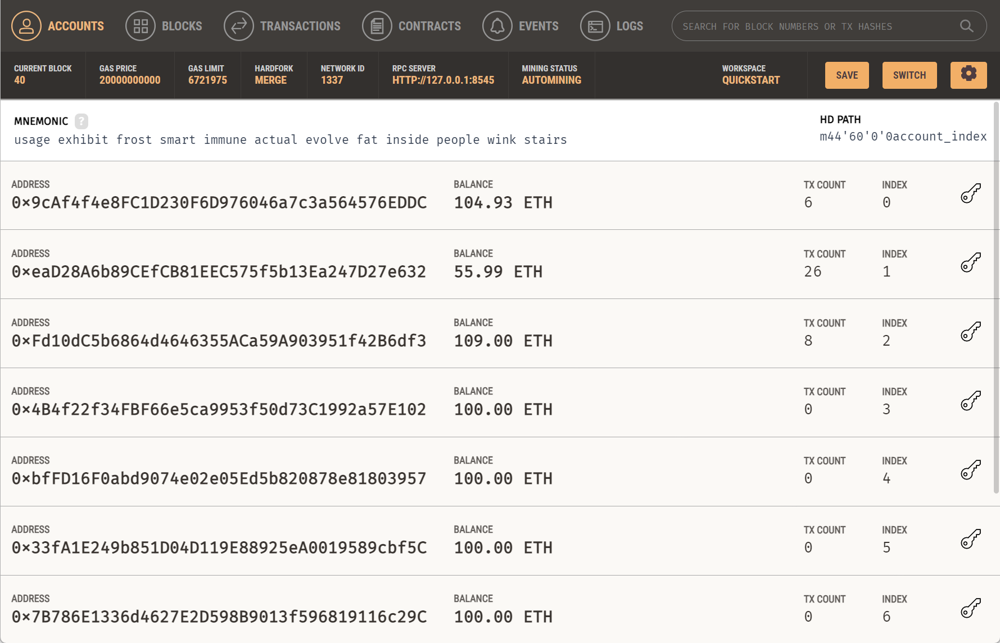
支付成功后我们看到房产已经变为了自己的，同时将5%的费用转给了第一个账户0.5ETH
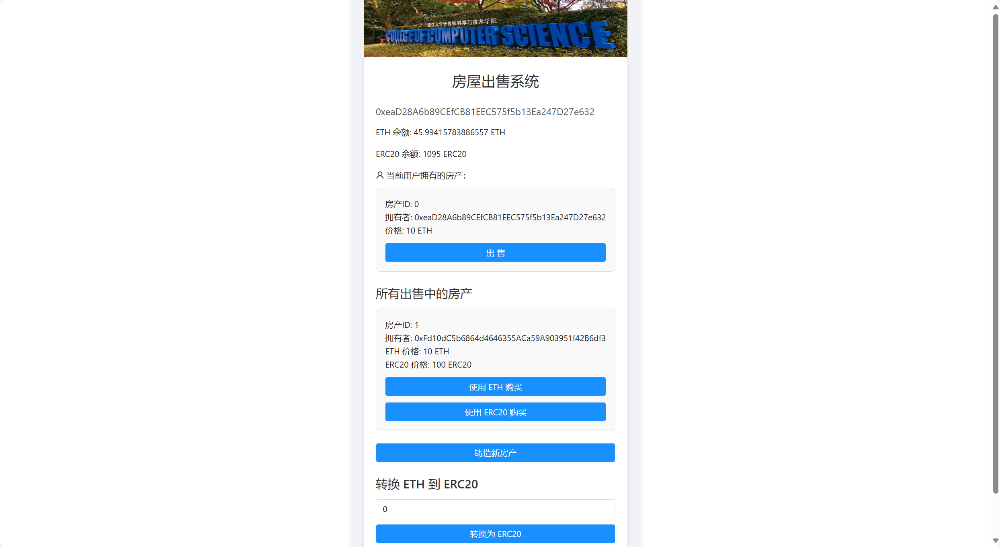

采用ERC20积分支付的方式支付第二个房产：
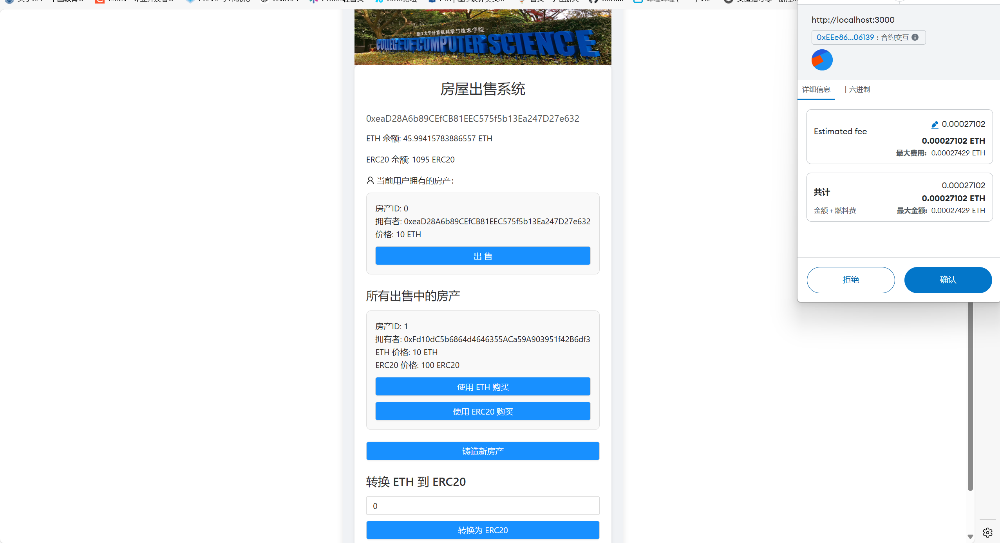
购买完成后可以看到两个房产都已经成为自己名下的，同时余额也被正常扣除：
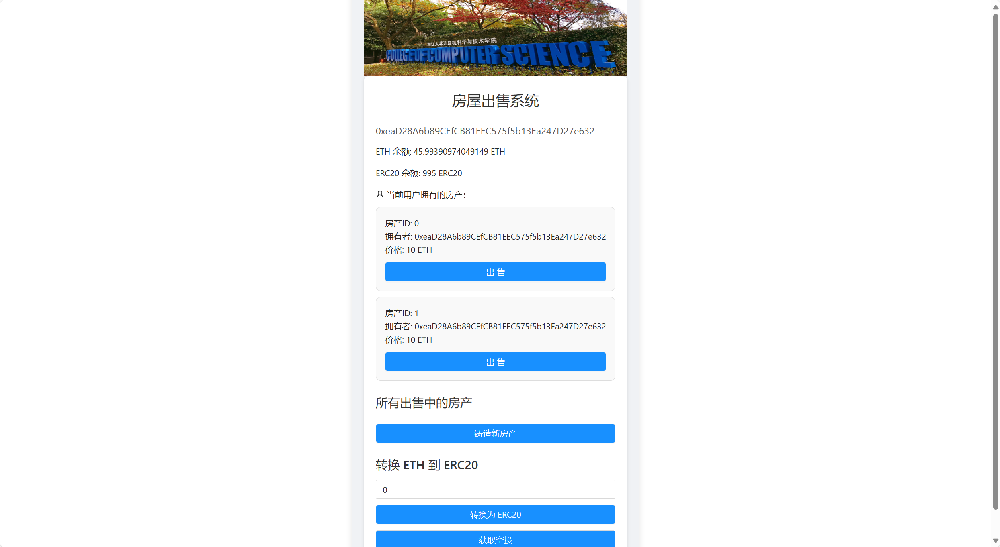
这时我们回到第一个账户，发现房产被正确卖出，余额正确到账：

最后是ETH转化为ERC20积分：
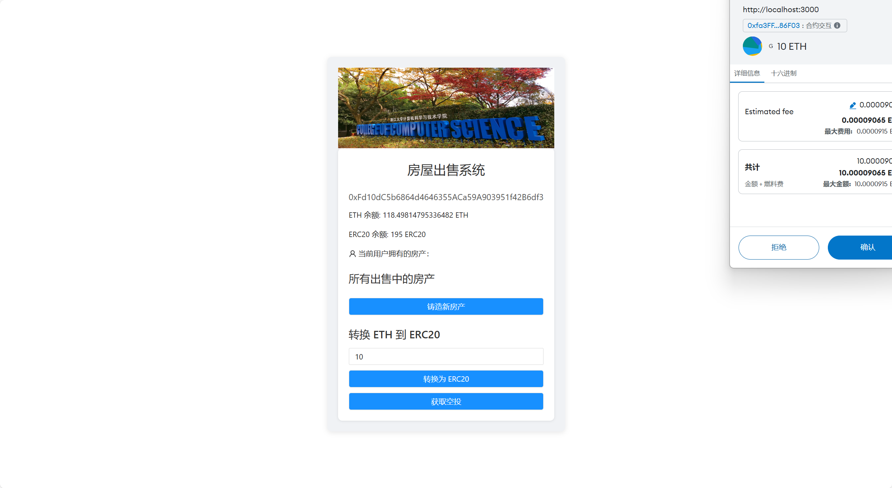
这里我们花费10ETH，应到账100ERC20积分，结果也确实如此：


## 参考内容

- 课程的参考Demo见：[DEMOs](https://github.com/LBruyne/blockchain-course-demos)。

- 快速实现 ERC721 和 ERC20：[模版](https://wizard.openzeppelin.com/#erc20)。记得安装相关依赖 ``"@openzeppelin/contracts": "^5.0.0"``。

- 如何实现ETH和ERC20的兑换？ [参考讲解](https://www.wtf.academy/en/docs/solidity-103/DEX/)

如果有其它参考的内容，也请在这里陈列。
